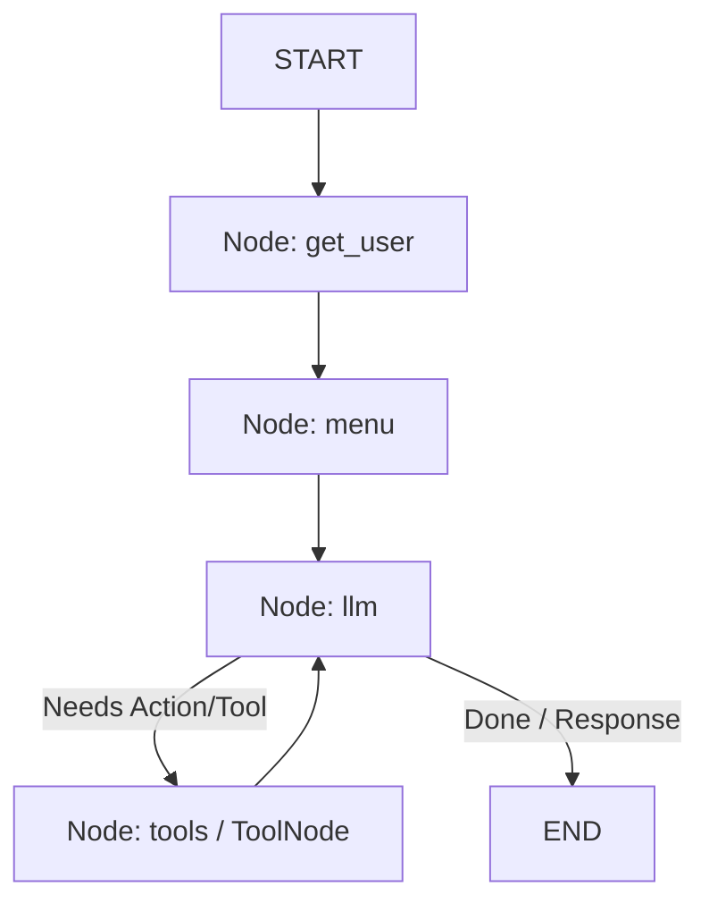

# 🍔 Blue Bites: LangGraph-Powered Restaurant Assistant

**Blue Bites** is an intelligent, conversational restaurant assistant designed to streamline the food ordering experience. Built on top of **LangGraph**, **LangChain**, and **Groq** (using `openai/gpt-oss-120b`), it demonstrates modern agentic workflows, featuring state persistence, fuzzy matching, and robust **Human-in-the-Loop (HITL)** approvals for order placements and billing.

---

## 🚀 Key Features

*   **Categorized Menu Visualizer**: Dynamically groups dishes from a local database (`menu.json`) into standard courses (Soup, Salad, Starters, Main Course, Bread, Dessert, Beverages) and formats them beautifully in the console.
*   **Fuzzy Search & Correction**: Uses python's `difflib` for spelling correction and fuzzy searching. If a user inputs `"paneer buter"`, the agent auto-corrects it to `"Paneer Butter Masala"` prior to tool invocation.
*   **Human-in-the-Loop Approvals**: Utilizes LangGraph's native `interrupt` mechanics to pause agent execution and request explicit user confirmation before:
    1.  Placing/confirming an food order.
    2.  Approving the final generated bill.
*   **Tax & Bill Generation**: Generates a standard receipt breakdown complete with itemized pricing, subtotal, and tax logic (9% CGST + 9% SGST).
*   **Persistent SQLite Checkpointing**: Conversational states are stored persistently using `SqliteSaver`. Returning users are recognized, and their conversation history is loaded back.
*   **Hardcopy Generation**: Option to export approved bills to a local `bill.txt` file.

---

## 🛠️ Tech Stack & Dependencies

*   **Language**: Python 3.10+
*   **Agent Framework**: LangGraph & LangChain
*   **LLM Provider**: ChatGroq (via `openai/gpt-oss-120b`)
*   **State Persistence**: SQLite (`SqliteSaver`)
*   **Spelling/String Matching**: `difflib`

---

## 📁 Repository Structure

```
.
├── app.py              # Main execution entrypoint & CLI interface (Handles interrupts & inputs)
├── graphh.py           # LangGraph structure (State, Nodes, Routing & Checkpointer)
├── tools.py            # Custom tool definitions (Ordering, Billing, Search, Hardcopy)
├── menu.json           # Restaurant database containing details of all items
├── .env                # API keys and local configuration
└── agent_db.sqlite     # Persistent SQLite database for LangGraph state
```

---

## ⚙️ Architecture & State Flow

The conversation follows a directed graph where state transitions are controlled by LangGraph:



1.  **`get_user`**: Obtains the customer name to contextualize the thread.
2.  **`menu`**: Loads `menu.json` and prints it to the console grouped by categories.
3.  **`llm`**: Receives prompt & runs the model, which is bound to the available restaurant tools.
4.  **`tools`**: Executes tools or triggers state interrupts for approvals, then sends responses back to the LLM.

---

## 🔧 Available Agent Tools

The agent has access to 5 specialized tools defined in [tools.py](file:///home/sumirann/Documents/DevLabs-2.0/Week4/submissions/Sumiran_Akre/tools.py):

| Tool Name | Parameters | Description |
| :--- | :--- | :--- |
| `get_menu` | `category: list` | Returns the full menu or filters items by categories (e.g., Bread, Dessert). |
| `search_dish` | `query: str` | Performs substring searches on name, category, description, and price. |
| `order_food` | `dish_name: list, quantity: int` | Stages an order. Triggers a LangGraph `interrupt` for order approval. |
| `generate_bill` | `order: list` | Compiles items ordered, calculates taxes, formatting a receipt. Triggers an `interrupt` for billing approval. |
| `get_hardcopy` | `bill: str` | Exports the approved bill string to a text file `bill.txt`. |

---

## 💻 Setup & Installation

1.  **Clone the repository** and navigate to your submission directory:
    ```bash
    cd /home/sumirann/Documents/DevLabs-2.0/Week4/submissions/Sumiran_Akre
    ```

2.  **Configure environment variables**:
    Create a `.env` file and specify your Groq API key:
    ```env
    groq="YOUR_GROQ_API_KEY"
    ```

3.  **Install dependencies**:
    ```bash
    pip install langchain-groq langgraph langchain-core python-dotenv
    ```

4.  **Run the application**:
    ```bash
    python app.py
    ```

---

## 📊 Sample Run Showcase

The execution below showcases the assistant interacting with the user, taking orders, querying details, requesting approval, and formatting the bill details.

```
--- MAIN COURSE ---                           
---------------------------------------------------------------------------
 * Paneer Butter Masala (Veg, Serves 2, Prep: 20 mins)          Rs. 340.00 
 * Butter Chicken (Non-Veg, Serves 2, Prep: 20 mins)            Rs. 380.00 
 * Dal Makhani (Veg, Serves 2, Prep: 20 mins)                   Rs. 290.00 
 * Mutton Rogan Josh (Non-Veg, Serves 2, Prep: 25 mins)         Rs. 450.00 
 * Kadhai Paneer (Veg, Serves 2, Prep: 20 mins)                 Rs. 330.00 
 * Mix Vegetable Curry (Veg, Serves 2, Prep: 20 mins)           Rs. 270.00 
 * Malai Kofta (Veg, Serves 2, Prep: 20 mins)                   Rs. 350.00 
 * Chana Masala (Veg, Serves 2, Prep: 20 mins)                  Rs. 240.00 
 * Chicken Korma (Non-Veg, Serves 2, Prep: 20 mins)             Rs. 370.00 
 * Fish Curry (Non-Veg, Serves 2, Prep: 20 mins)                Rs. 410.00 
 * Egg Curry (Non-Veg, Serves 2, Prep: 20 mins)                 Rs. 230.00 
 * Dal Tadka (Veg, Serves 2, Prep: 20 mins)                     Rs. 210.00 
 * Veg Biryani (Veg, Serves 2, Prep: 25 mins)                   Rs. 290.00 
 * Chicken Biryani (Non-Veg, Serves 2, Prep: 25 mins)           Rs. 360.00 
 * Mutton Dum Biryani (Non-Veg, Serves 2, Prep: 25 mins)        Rs. 440.00 
 * Jeera Rice (Veg, Serves 2, Prep: 12 mins)                    Rs. 160.00 
 * Steamed Basmati Rice (Veg, Serves 2, Prep: 12 mins)          Rs. 130.00 
                               
--- BREAD ---                              
---------------------------------------------------------------------------
 * Plain Naan (Veg, 1 piece, Prep: 5 mins)                       Rs. 50.00 
 * Butter Naan (Veg, 1 piece, Prep: 5 mins)                      Rs. 55.00 
 * Garlic Naan (Veg, 1 piece, Prep: 5 mins)                      Rs. 60.00 
 * Tandoori Roti (Veg, 1 piece, Prep: 5 mins)                    Rs. 30.00 
 * Butter Roti (Veg, 1 piece, Prep: 5 mins)                      Rs. 35.00 
 * Laccha Paratha (Veg, 1 piece, Prep: 5 mins)                   Rs. 50.00 
                              
--- DESSERT ---                             
---------------------------------------------------------------------------
 * Gulab Jamun (Veg, 2 pieces, Prep: 5 mins)                    Rs. 110.00 
 * Chocolate Lava Cake (Veg, 1 piece, Prep: 12 mins)            Rs. 180.00 
 * Rasmalai (Veg, 2 pieces, Prep: 5 mins)                       Rs. 130.00 
 * Vanilla Ice Cream (Veg, 1 scoop, Prep: 5 mins)                Rs. 80.00 
 * Chocolate Ice Cream (Veg, 1 scoop, Prep: 5 mins)              Rs. 90.00 
 * Sizzling Brownie (Veg, Serves 1, Prep: 12 mins)              Rs. 220.00 
                             
--- BEVERAGE ---                             
---------------------------------------------------------------------------
 * Virgin Mojito (Veg, 300 ml, Prep: 5 mins)                    Rs. 140.00 
 * Mango Lassi (Veg, 300 ml, Prep: 5 mins)                      Rs. 120.00 
 * Sweet Lassi (Veg, 300 ml, Prep: 5 mins)                      Rs. 100.00 
 * Salted Lassi (Veg, 300 ml, Prep: 5 mins)                     Rs. 100.00 
 * Fresh Lime Soda (Veg, 300 ml, Prep: 5 mins)                   Rs. 90.00 
 * Cold Coffee with Ice Cream (Veg, 300 ml, Prep: 5 mins)       Rs. 150.00 
 * Masala Chai (Veg, 150 ml, Prep: 7 mins)                       Rs. 50.00 
 * Mineral Water (Veg, 1 Litre, Prep: 1 min)                     Rs. 40.00 

===========================================================================
You : place my order of 2 Garlic Naan with 1 Butter Chicken served alongside 1 Mojito
[ TOOL CALLED ] order_food
[  TOOL ARGS  ] {'dish_name': ['Garlic Naan'], 'quantity': 2}

========================================
         ORDER APPROVAL REQUIRED         
========================================
Dish Name  : Garlic Naan
Quantity   : 2
Price      : Rs. 60.00
Total      : Rs. 120.00
----------------------------------------
========================================
Approve this order? (yes/no): y

========================================
         ORDER APPROVAL REQUIRED         
========================================
Dish Name  : Butter Chicken
Quantity   : 1
Price      : Rs. 380.00
Total      : Rs. 380.00
----------------------------------------
========================================
Approve this order? (yes/no): y

========================================
         ORDER APPROVAL REQUIRED         
========================================
Dish Name  : Virgin Mojito
Quantity   : 1
Price      : Rs. 140.00
Total      : Rs. 140.00
----------------------------------------
========================================
Approve this order? (yes/no): y

========================================
          BILL APPROVAL REQUIRED         
========================================
================================================
              B L U E   B I T E S               
      123 Culinary Boulevard, Food Street       
             GSTIN: 27AAAAA1111A1Z1             
------------------------------------------------
 Date: 05-07-2026      Time: 14:17:34           
 Bill No: BB-05141734                           
------------------------------------------------
 Item Name              Qty     Price     Total 
------------------------------------------------
 Garlic Naan             2      60.00    120.00 
 Butter Chicken          1     380.00    380.00 
 Virgin Mojito           1     140.00    140.00 
------------------------------------------------
  Subtotal:                              640.00 
  CGST (9%):                              57.60 
  SGST (9%):                              57.60 
------------------------------------------------
  Grand Total:                           755.20 
================================================
         Thank you for dining with us!          
                Visit Us Again!                 
================================================
========================================
Approve this bill? (yes/no): yes
============================================================
Bot : Sure thing, Sumiran! Your order has been placed successfully. Here’s the summary and the bill:

**Order Summary**  
- 2 × Garlic Naan – ₹60 each  
- 1 × Butter Chicken – ₹380  
- 1 × Virgin Mojito – ₹140  

**Bill**  

```
================================================
              B L U E   B I T E S               
      123 Culinary Boulevard, Food Street       
             GSTIN: 27AAAAA1111A1Z1             
------------------------------------------------
 Date: 05-07-2026      Time: 14:17:40           
 Bill No: BB-05141740                           
------------------------------------------------
 Item Name              Qty     Price     Total 
------------------------------------------------
 Garlic Naan             2      60.00    120.00 
 Butter Chicken          1     380.00    380.00 
 Virgin Mojito           1     140.00    140.00 
------------------------------------------------
  Subtotal:                              640.00 
  CGST (9%):                              57.60 
  SGST (9%):                              57.60 
------------------------------------------------
  Grand Total:                           755.20 
================================================
         Thank you for dining with us!          
                Visit Us Again!                 
================================================
```

Your total comes to **₹755.20** (including taxes).  

Would you like a hard‑copy of the bill emailed to you, or is there anything else I can help you with?
============================================================
You : 
```
You : place my order of 2 Garlic Naan with 1 Butter Chicken served alongside 1 Mojito
[ TOOL CALLED ] order_food
[  TOOL ARGS  ] {'dish_name': ['Garlic Naan'], 'quantity': 2}

========================================
         ORDER APPROVAL REQUIRED         
========================================
Dish Name  : Garlic Naan
Quantity   : 2
Price      : Rs. 60.00
Total      : Rs. 120.00
----------------------------------------
========================================
Approve this order? (yes/no): y

========================================
         ORDER APPROVAL REQUIRED         
========================================
Dish Name  : Butter Chicken
Quantity   : 1
Price      : Rs. 380.00
Total      : Rs. 380.00
----------------------------------------
========================================
Approve this order? (yes/no): y

========================================
         ORDER APPROVAL REQUIRED         
========================================
Dish Name  : Virgin Mojito
Quantity   : 1
Price      : Rs. 140.00
Total      : Rs. 140.00
----------------------------------------
========================================
Approve this order? (yes/no): y

========================================
          BILL APPROVAL REQUIRED         
========================================
================================================
              B L U E   B I T E S               
      123 Culinary Boulevard, Food Street       
             GSTIN: 27AAAAA1111A1Z1             
------------------------------------------------
 Date: 05-07-2026      Time: 14:17:34           
 Bill No: BB-05141734                           
------------------------------------------------
 Item Name              Qty     Price     Total 
------------------------------------------------
 Garlic Naan             2      60.00    120.00 
 Butter Chicken          1     380.00    380.00 
 Virgin Mojito           1     140.00    140.00 
------------------------------------------------
  Subtotal:                              640.00 
  CGST (9%):                              57.60 
  SGST (9%):                              57.60 
------------------------------------------------
  Grand Total:                           755.20 
================================================
         Thank you for dining with us!          
                Visit Us Again!                 
================================================
========================================
Approve this bill? (yes/no): yes
============================================================
Bot : Sure thing, Sumiran! Your order has been placed successfully. Here’s the summary and the bill:

**Order Summary**  
- 2 × Garlic Naan – ₹60 each  
- 1 × Butter Chicken – ₹380  
- 1 × Virgin Mojito – ₹140  

**Bill**  

```
================================================
              B L U E   B I T E S               
      123 Culinary Boulevard, Food Street       
             GSTIN: 27AAAAA1111A1Z1             
------------------------------------------------
 Date: 05-07-2026      Time: 14:17:40           
 Bill No: BB-05141740                           
------------------------------------------------
 Item Name              Qty     Price     Total 
------------------------------------------------
 Garlic Naan             2      60.00    120.00 
 Butter Chicken          1     380.00    380.00 
 Virgin Mojito           1     140.00    140.00 
------------------------------------------------
  Subtotal:                              640.00 
  CGST (9%):                              57.60 
  SGST (9%):                              57.60 
------------------------------------------------
  Grand Total:                           755.20 
================================================
         Thank you for dining with us!          
                Visit Us Again!                 
================================================
```

Your total comes to **₹755.20** (including taxes).  

Would you like a hard‑copy of the bill emailed to you, or is there anything else I can help you with?
============================================================