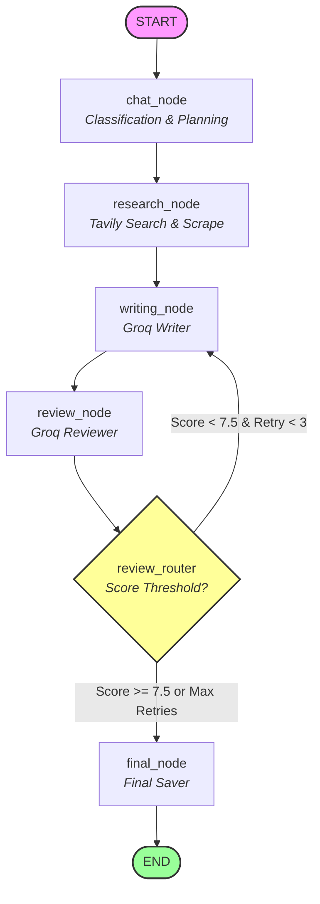

# 🤖 Multi-Agent Research Crew using LangGraph

An advanced **Multi-Agent AI workflow** built using **LangGraph**, **LangChain Groq**, and **Tavily Search**. This project implements a collaborative pipeline where specialized agents sequentially research a topic, write a structured article, and review/edit the final content.

---

## 🚀 Features

* **Query Classification**: A routing agent classifies the incoming query.
* **Tavily Web Search Integration**: Real-time research gathers facts, applications, advantages, and challenges.
* **Structured Review Schema**: The reviewer grades the written article and suggests concrete edits.
* **Sequential Graph Process**: A fully compiled state graph runs sequentially and handles state variables across steps.
* **Dynamic Console Output**: Streams intermediate state snippets so you can observe the agents' progress in real-time.

---

## 🏗️ Project Architecture



---

## 📋 Node Outputs (Execution Example)

When you run the application, the sequential multi-agent workflow streams details from each node in the following format:

### 1. Lead Coordinator (`chat_node`)
Classifies the input topic, maps objectives, and suggests target search queries.
```text
[Node: CHAT_NODE started]
[ AGENT ] : **1. Target Research Topic**  
Artificial Intelligence (AI) Applications and Impact in Healthcare  

**2. Key Objectives**  

| # | Objective | Description |
|---|-----------|-------------|
| 1 | **Clinical Decision Support** | Examine how AI models assist diagnosis, treatment planning, and prognosis across specialties. |
| 2 | **Predictive Analytics & Population Health** | Investigate AI‑driven risk stratification, outbreak forecasting, and resource allocation. |
| 3 | **Medical Imaging & Computer Vision** | Review AI techniques for image acquisition, segmentation, and anomaly detection. |
| 4 | **NLP in Documentation** | Assess AI tools for EHR summarization, clinical note extraction, and coding automation. |
| 5 | **Robotics & Automation** | Explore AI‑controlled surgical robots, autonomous dispensing, and wearables. |
| 6 | **Personalized Medicine & Genomics** | Analyze AI methods for genotype‑phenotype correlation and drug response prediction. |
| 7 | **Ethical, Legal, and Regulatory** | Identify challenges related to bias, data privacy (HIPAA/GDPR), and regulatory frameworks. |
| 8 | **Economic Impact & Barriers** | Quantify cost‑benefit, adoption hurdles (interoperability, trust), and scalability. |
| 9 | **Clinical Trials & Evidence** | Review AI‑enabled trial design, recruitment, and outcome monitoring. |
| 10| **Future Directions & Trends** | Highlight multimodal AI, federated learning, edge AI, and drug discovery pipelines. |

**3. Suggested Search Terms for the Research Agent**  

| Category | Search Terms |
|----------|--------------|
| General Overview | “Artificial intelligence in healthcare review 2023”, “state of AI healthcare 2024” |
| Clinical Decision Support | “AI clinical decision support systems”, “AI treatment recommendation oncology” |
| Predictive Analytics | “AI predictive analytics hospital readmission”, “AI disease outbreak forecasting” |
| Medical Imaging | “AI medical imaging segmentation”, “AI breast cancer detection mammography” |
| NLP & EHR | “NLP electronic health records”, “automated medical coding AI” |
| Robotics & Automation | “AI surgical robot performance”, “AI-powered patient monitoring wearables” |
| Genomics & Medicine | “AI genomics variant interpretation”, “AI precision oncology” |
| Ethics & Regulation | “AI bias healthcare”, “FDA AI/ML SaMD guidance”, “EU AI Act medical devices” |
| Economic Impact | “cost‑benefit AI healthcare implementation”, “barriers to AI adoption in clinics” |
| Clinical Trials | “AI‑enabled clinical trial recruitment”, “AI monitoring clinical trial outcomes” |
| Emerging Trends | “federated learning healthcare”, “multimodal AI medicine”, “AI drug discovery pipelines 2024” |

[Node: CHAT_NODE completed]
```

### 2. Research Agent (`research_node`)
Executes sequential search/scrape tools to compile comprehensive research findings.
```text
 ---> [ TOOL ] == web_search
 ---> [ ARGS ] == {'query': 'Artificial intelligence in healthcare review 2023'}
 ---> [ TOOL ] == web_search
 ---> [ ARGS ] == {'query': 'AI clinical decision support systems'}
 ... (Subsequent sequential search queries executed) ...
 ---> [ TOOL ] == web_search
 ---> [ ARGS ] == {'query': 'AI breast cancer detection mammography'}

[Node: RESEARCH_NODE started]
----------------------------------------
Research Findings (Snippet):
## **Artificial Intelligence (AI) Applications and Impact in Healthcare: A Comprehensive Review**  

### **1. Clinical Decision Support**  

- **AI Models**: Deep learning and reinforcement learning are increasingly used in clinical decision support systems (CDSS) to assist with diagnosis, treatment...
----------------------------------------
[Node: RESEARCH_NODE completed]
```

### 3. Writing Agent (`writing_node`)
Generates the comprehensive review article using the compiled research findings.
```text
[Node: WRITING_NODE started]
----------------------------------------
Written Draft (Snippet):
# Artificial Intelligence in Healthcare: A Comprehensive Review
Artificial Intelligence (AI) is transforming the healthcare landscape by enhancing clinical decision-making, improving patient outcomes, and streamlining healthcare operations. This comprehensive review explores the applications, impact...
----------------------------------------
[Node: WRITING_NODE completed]
```

### 4. Reviewer Agent (`review_node`)
Evaluates the draft for quality and relevance, assigning a score and actionable improvement recommendations.
```text
[Node: REVIEW_NODE started]
============================================================
                   FINAL POLISHED ARTICLE                   
============================================================
# Artificial Intelligence in Healthcare: A Comprehensive Review

**Artificial Intelligence (AI) is reshaping the healthcare ecosystem** by augmenting clinical decision‑making, improving patient outcomes, and streamlining operations. This review surveys the most impactful AI applications, examines current challenges, and outlines emerging trends that could define the next era of medical practice...
============================================================
Review Score: 8/10
Suggestions: Reduce repetitive phrasing (e.g., "AI models predict" appears multiple times)., Combine overlapping bullet points under Predictive Analytics and Population Health for conciseness., Add brief discussion of real‑world implementation examples or case studies to enhance completeness., Include a short paragraph on data quality and interoperability challenges, which are critical for AI adoption., Provide citations or references to major studies or regulatory frameworks to strengthen credibility.
============================================================
[Node: REVIEW_NODE completed]
```

### 5. Final Saver (`final_node`)
Saves the finalized draft to the disk in Markdown format.
```text
[Node: FINAL_NODE started]
[ AGENT ] : Final Draft saved to draft.md. Results: Draft successfully saved to draft.md
[Node: FINAL_NODE completed]
```

---

## 📂 Project Structure

```text
.
├── config.py             # LLM model initializations
├── tools.py              # Search & file utility definitions
├── state_and_prompts.py  # TypedDict schemas, Enums, and prompt instructions
├── nodes.py              # Individual agent node execution functions
├── graph.py              # StateGraph assembly & compilation
├── main.py               # Application entry point CLI
├── .env                  # Environment keys config (GROQ_API_KEY / TAVILY_API_KEY)
└── requirements.txt      # Dependency list
```

---

## ⚙️ Setup and Installation

### 1. Clone the repository
```bash
git clone <repository-url>
cd Week5/Submissions/Sumiran_Akre
```

### 2. Configure Environment Variables
Create a `.env` file in the project folder and define:
```env
GROQ_API=your_groq_api_key
TAVILY_API_KEY=your_tavily_api_key
```

### 3. Install Dependencies
```bash
pip install -r requirements.txt
```

### 4. Run the application
```bash
python main.py
```

---

## 🎯 Learning Outcomes
* Designed state representations using `TypedDict` and `Annotated[List[BaseMessage], add_messages]`.
* Handled LLM outputs and parsed them into structured objects using `.with_structured_output()`.
* Structured sequential and deterministic multi-agent systems using `StateGraph`.
* Integrated external APIs (Tavily Search) and parsing web documents dynamically.
